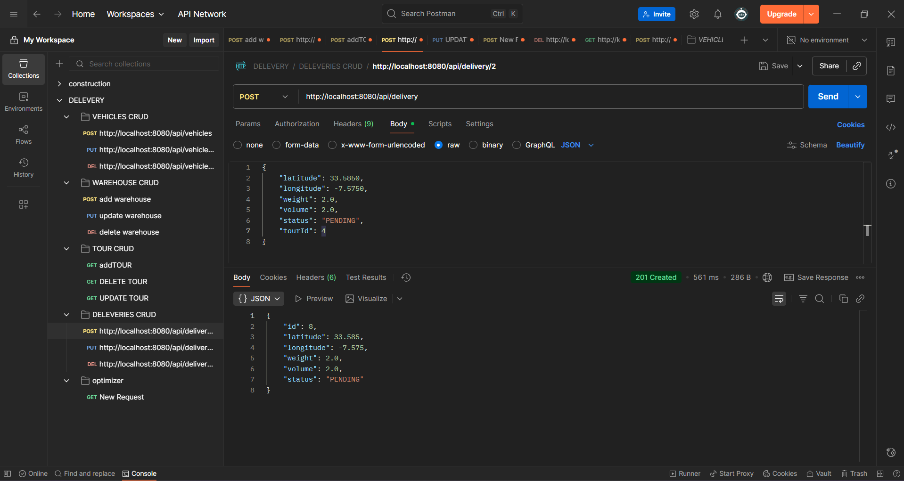
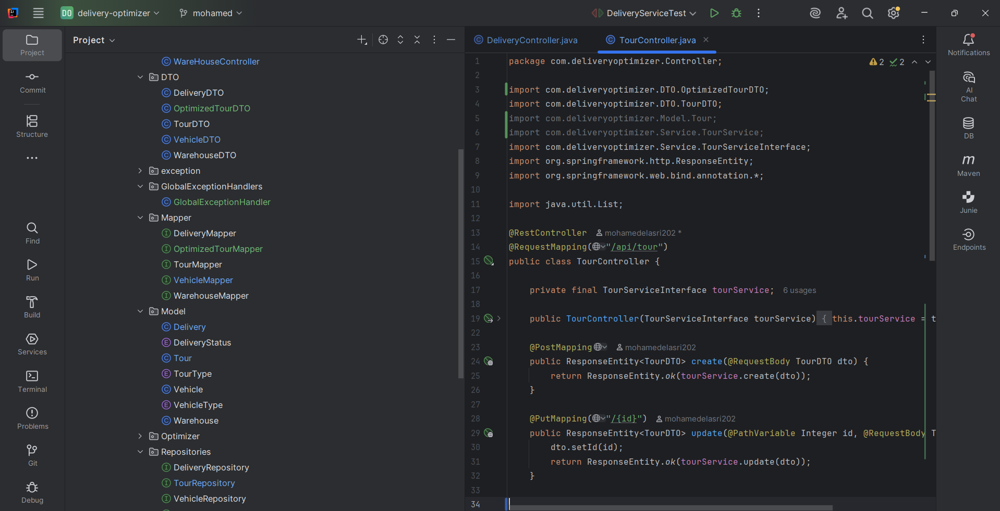
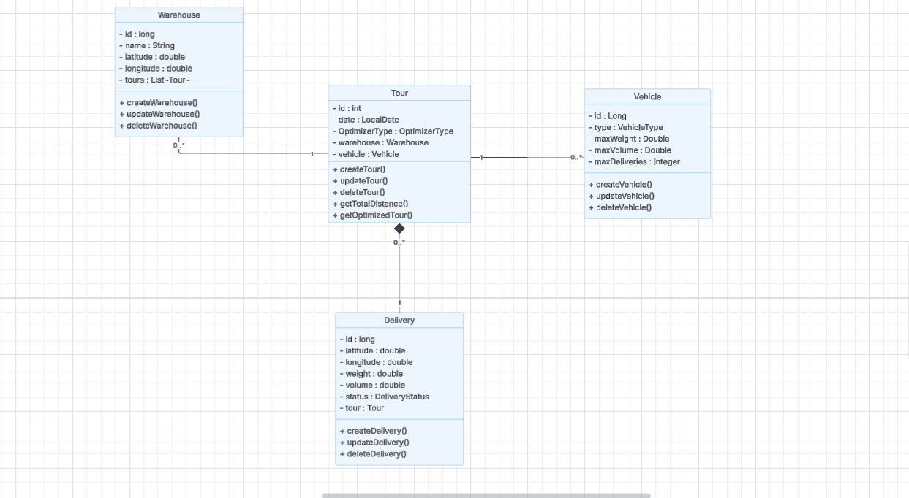

# 🚚 Optimized Delivery Route Management System

## Project Description
**Context:**  
Due to a significant increase in fuel costs and customer numbers, a logistics company faces major challenges in optimizing delivery routes. Currently, the system uses a simple *Nearest Neighbor* algorithm, which generates inefficient routes. The company wants to modernize the system by adopting the **Clarke & Wright** algorithm to reduce traveled distances.

**Goal:** Develop a Spring Boot web application to manage the full delivery process and intelligently optimize routes.

---

## Main Functional Objectives
- Manage a heterogeneous vehicle fleet (BIKE, VAN, TRUCK) with constraints (capacity, range)
- Automatically plan and optimize delivery routes
- Compare performance of **NearestNeighborOptimizer** and **ClarkeWrightOptimizer**
- Full CRUD for business entities (Warehouse, Vehicle, Delivery, Tour)
- Visualize optimized routes (ordered list of deliveries)
- Unit tests (JUnit) and API tests via Postman
- API documentation via Swagger

---

## Technologies
- Java 8+
- Spring Boot (no annotation-based injection — beans configured via `applicationContext.xml`)
- Spring Data JPA (JpaRepository)
- H2 (embedded database)
- Lombok (allowed)
- Swagger (for API documentation)
- JUnit for unit testing
- SLF4J (logger)


> ⚠️ **Important constraints:**
> - No annotation-based injection (`@Autowired`, `@Service`, `@Repository`, `@Component`, `@Bean`, etc.). All dependencies must be defined in `applicationContext.xml`.
> - Use H2 only (dependency via `pom.xml`).

---

## Suggested Repository Structure
delivery-optimizer/
├── README.md
├── images/
│ ├── postman.png
│ ├── swagger.png
│ └── class-diagram.png
├── docs/
│ ├── postman_collection.json
│ └── swagger/
├── src/
│ ├── main/
│ └── test/
└── pom.xml

yaml
Copy code

---


## Installation and Local Execution
1. Clone the repository:
```bash
git clone <repo-url>
cd delivery-optimizer
Configure application.properties:

properties
Copy code
server.port=8080
spring.datasource.url=jdbc:h2:mem:deliverydb;DB_CLOSE_DELAY=-1;DB_CLOSE_ON_EXIT=FALSE
spring.datasource.driverClassName=org.h2.Driver
spring.datasource.username=sa
spring.datasource.password=
spring.jpa.hibernate.ddl-auto=update
Define all beans in src/main/resources/applicationContext.xml
(services, repositories, optimizers, mappers, etc.)

Run the application:

bash
Copy code
mvn clean package
mvn spring-boot:run
Access:

H2 Console: http://localhost:8080/h2-console

Swagger UI: http://localhost:8080/swagger-ui.html


Warehouses

bash
Copy code
GET    /warehouses
GET    /warehouses/{id}
POST   /warehouses
PUT    /warehouses/{id}
DELETE /warehouses/{id}
Vehicles

bash
Copy code
GET    /vehicles
GET    /vehicles/{id}
POST   /vehicles
PUT    /vehicles/{id}
DELETE /vehicles/{id}
Deliveries

bash
Copy code
GET    /deliveries
GET    /deliveries/{id}
POST   /deliveries
PUT    /deliveries/{id}
DELETE /deliveries/{id}
Tours

bash
Copy code
GET    /tours
GET    /tours/{id}
POST   /tours
PUT    /tours/{id}
DELETE /tours/{id}
POST   /tours/{id}/optimize
GET    /tours/{id}/Compare
Models / Entities (Summary)
Warehouse: id, name, address, lat, lon, openingHours

Vehicle: id, type (BIKE|VAN|TRUCK), maxWeightKg, maxVolumeM3, maxDeliveries

Delivery: id, lat, lon, weightKg, volumeM3, preferredTimeSlot, status (PENDING, IN_TRANSIT, DELIVERED, FAILED)

Tour: id, date, vehicleId, warehouseId, orderedDeliveries[], totalDistanceKm

Key Interfaces
TourOptimizer

java
Copy code
List<Delivery> calculateOptimalTour(Tour tour, List<Delivery> deliveries);
TourService

java
Copy code
List<DeliveryDTO> getOptimizedTour(Long tourId, String algorithm);
double getTotalDistance(Long tourId);
Expected implementations:

NearestNeighborOptimizer implements TourOptimizer

ClarkeWrightOptimizer implements TourOptimizer

Algorithms (Summary)
Nearest Neighbor: choose the nearest unvisited client — fast but long routes

Clarke & Wright: calculate savings E(i,j) = d(W,i) + d(W,j) - d(i,j) then merge routes in descending order of savings — better optimization for larger datasets

Vehicle Constraints
BIKE: max 50 kg, 0.5 m³, max 15 deliveries per tour

VAN: max 1000 kg, 8 m³, max 50 deliveries per tour

TRUCK: max 5000 kg, 40 m³, max 100 deliveries per tour

Screenshots & Documentation
markdown
Copy code
### Documentation & Screenshots
```
**Postman (collection)**  


**Swagger UI**  


**App Screenshots**  


**UML Class Diagram**  

Deliverables Checklist
Complete source code (Git repo)

JIRA link / exported tasks

Postman collection (docs/postman_collection.json)

Class diagrams (images/class-diagram.png)

README (this file)


Unit tests 


